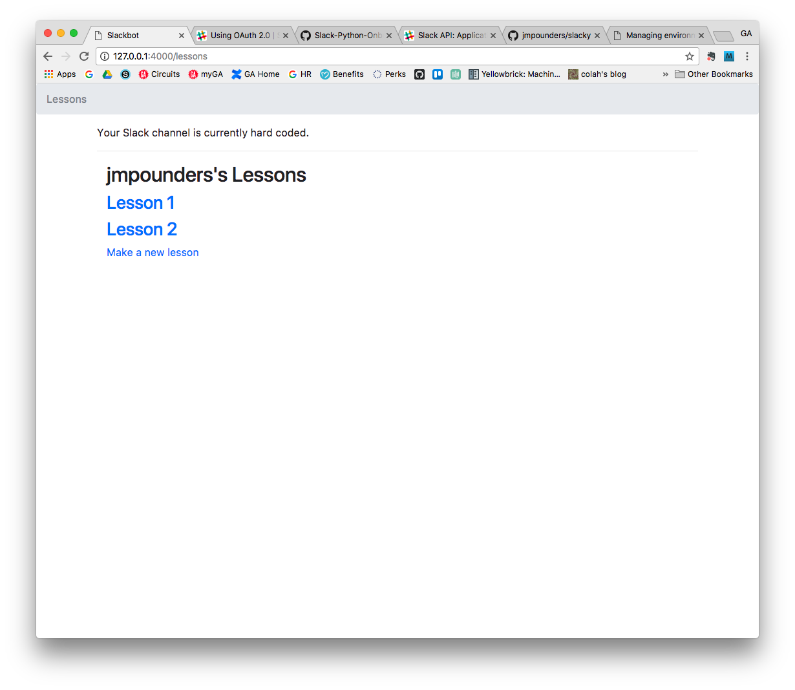

# Slacky

## What Can You Do

Create lessons...



that contain checks for understanding...


that you create...


that can be posted to Slack with a single click...


## Conda Environment

To create a `conda` enviroment preconfigured for Slacky enter

```
conda env create -f conda_env.yml
```

## Slack Authentication

Slacky is not currently configured for general Slack OAuth.  It is only available in my workspace.


